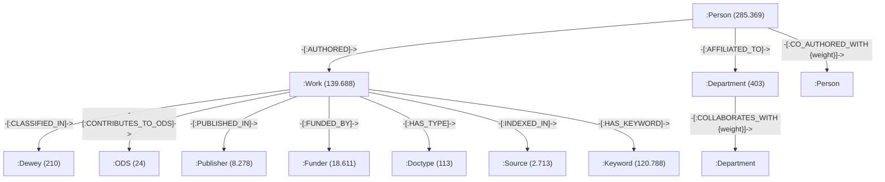

# Documentación del Modelo de Grafo de Conocimiento y Neo4j (VRID-AlumniUC)

## 1. Visión General del Grafo

El **Grafo de Conocimiento de VRID-AlumniUC** modela la producción científica, la red de co-autorías de investigadores y alumni UC, la colaboración interdisciplinaria entre facultades, y el alineamiento con áreas disciplinares (Dewey) y Objetivos de Desarrollo Sostenible (ODS).

- **Fuente de Datos**: `data/EXPORT_SIPA_clean.csv` (139.688 registros procesados)
- **Nodos Totales**: **576.107 nodos** (10 tipos de entidades)
- **Relaciones Totales**: **2.487.777 aristas** (11 tipos de relaciones)
- **Directorio de Archivos Exportados**: `data/graph/` y `data/graph/neo4j/`

---

## 2. Esquema de Entidades y Relaciones (Diagrama Neo4j)



---

## 3. Catálogo de Nodos y Propiedades

| Etiqueta (:Label)         | Cantidad | Atributo Principal (ID) | Atributos Adicionales                                 |
| :------------------------ | :------: | :---------------------- | :---------------------------------------------------- |
| **`:Work`**       | 139.688 | `work_id`             | `title`, `issued_year`, `doi`, `rights`       |
| **`:Person`**     | 285.369 | `person_id`           | `name`, `codpers`, `orcid`, `is_uc` (BOOLEAN) |
| **`:Department`** |   403   | `dept_id`             | `name`                                              |
| **`:Dewey`**      |   210   | `dewey_code`          | `name_es`                                           |
| **`:ODS`**        |    24    | `ods_code`            | `name_en`, `name_es`                              |
| **`:Publisher`**  |  8.278  | `publisher_id`        | `name`                                              |
| **`:Funder`**     |  18.611  | `funder_id`           | `name`                                              |
| **`:Doctype`**    |   113   | `type_id`             | `name`                                              |
| **`:Source`**     |  2.713  | `source_id`           | `name`                                              |
| **`:Keyword`**    | 120.788 | `keyword_id`          | `name`                                              |

---

## 4. Catálogo de Relaciones y Pesos

| Relación (Type)                       | Origen$\rightarrow$ Destino    | Cantidad | Descripción / Atributos                                    |
| :------------------------------------- | :------------------------------- | :------: | :---------------------------------------------------------- |
| **`-[:AUTHORED]->`**           | `(:Person)->(:Work)`           | 434.455 | Autoría directa de la publicación                         |
| **`-[:AFFILIATED_TO]->`**      | `(:Person)->(:Department)`     |  25.808  | Afiliación académica a Facultad/Unidad UC                 |
| **`-[:CO_AUTHORED_WITH]->`**   | `(:Person)->(:Person)`         | 747.695 | Red de co-autoría (`weight`: número de obras en común) |
| **`-[:CLASSIFIED_IN]->`**      | `(:Work)->(:Dewey)`            | 139.582 | Área del conocimiento según Dewey                         |
| **`-[:CONTRIBUTES_TO_ODS]->`** | `(:Work)->(:ODS)`              | 139.580 | Impacto en Objetivos de Desarrollo Sostenible               |
| **`-[:PUBLISHED_IN]->`**       | `(:Work)->(:Publisher)`        | 139.577 | Editorial o revista de difusión                            |
| **`-[:COLLABORATES_WITH]->`**  | `(:Department)->(:Department)` |  2.425  | Interdisciplinariedad (`weight`: obras interfacultades)   |
| **`-[:FUNDED_BY]->`**          | `(:Work)->(:Funder)`           | 173.978 | Agencia o proyecto de financiamiento (ANID, Fondecyt)       |
| **`-[:HAS_TYPE]->`**           | `(:Work)->(:Doctype)`          | 139.598 | Tipo formal de documento (Artículo, Tesis, Patente)        |
| **`-[:INDEXED_IN]->`**         | `(:Work)->(:Source)`           | 223.561 | Indexación en Scopus, WoS, PubMed, etc.                    |
| **`-[:HAS_KEYWORD]->`**        | `(:Work)->(:Keyword)`          | 323.925 | Palabras clave temáticas                                   |

---

## 5. Instrucciones de Importación a Neo4j

### Opción A: Carga mediante Cypher Shell / Neo4j Browser (`import_to_neo4j.cypher`)

1. Copie los archivos CSV de `data/graph/neo4j/cypher_import/` al directorio `import/` de su instancia de Neo4j.
2. Ejecute el script `data/graph/neo4j/import_to_neo4j.cypher`.

### Opción B: Carga Masiva Ultra Rápida (`neo4j-admin database import`)

Para instancias locales o de servidor, ejecute:

```cmd
data\\graph\\neo4j\\neo4j_admin_import.bat
```

---

## 6. Visualizaciones y Gráficos Generados

Se han generado gráficos analíticos en `data/graph/charts/`:

1. `chart_1_top_departments.png`: Top 15 Facultades y Unidades UC por volumen de afiliados.
2. `chart_2_ods_distribution.png`: Distribución de publicaciones científicas por ODS.
3. `chart_3_interdepartmental_collaboration.png`: Red de colaboración interdisciplinaria interfacultades.
4. `chart_4_top_coauthorship.png`: Top 15 Investigadores UC por volumen acumulado de co-autorías.
5. `interactive_interdepartmental_network.html`: Red interactiva 3D/PyVis de Unidades UC.
